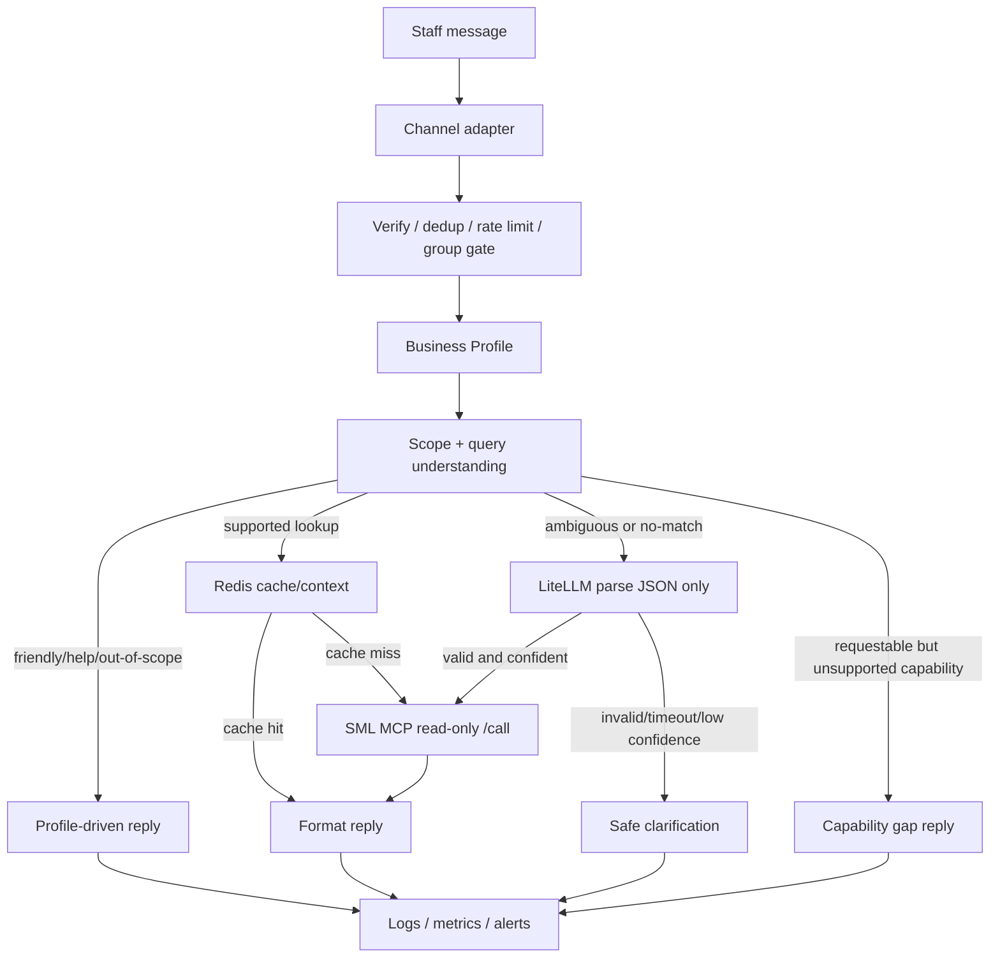

# Data Acquisition

Last updated: 2026-06-11

This document explains how the chatbot acquires data, what is considered source of truth, and what is intentionally not fetched yet.

## Summary

- Runtime facts for inventory search, stock, and price come from configured read-only connectors only. The current pilot connector is SML MCP at `SML_MCP_BASE_URL`.
- The bot does not read the SML Postgres database directly and does not use arbitrary SQL/database tools.
- LiteLLM is a parser only. It may help choose a structured action/query/capability, but it is never a source of price, stock, availability, or product facts.
- Redis stores ephemeral operational state: dedup, rate limits, cache, and short-lived chat context.
- App analytics currently use `/metrics`, structured logs, optional QA trace logs, QA fixtures, readiness-gate output, and reviewed staff transcripts. There is no warehouse/BI source connected yet.
- PyThaiNLP is an offline evaluation tool for reviewed Thai examples. It is not part of the Node.js request path.

## Source Matrix

| Data need | Current source | Method | Used for | Stored by bot |
| --- | --- | --- | --- | --- |
| Incoming staff messages | Telegram polling now; LINE webhook later | Channel adapter | Trigger lookup/help/out-of-scope flow | Event metadata, hashes, dedup keys |
| Tenant vocabulary and UX copy | Business Profile JSON | File loader with validation | Parser phrases, examples, aliases, help text, capability labels | Loaded config |
| Product/entity candidates | SML MCP | `POST /call` `search_product` | Search and multi-match choices | Redis search cache with TTL |
| Stock/availability facts | SML MCP | `POST /call` `get_stock_balance` | User-facing stock/availability replies | Redis stock cache with short TTL |
| Price facts | SML MCP | `POST /call` `get_product_price` | User-facing price replies | Redis price cache with TTL |
| Short chat context | Redis | Bot-owned keys | `1-5`, `เพิ่ม`, `ราคา`, `ตัวนี้` follow-ups | Ephemeral session context |
| Ambiguous parse help | LiteLLM router | `/v1/chat/completions` JSON output | Structured parse/capability classification only | Metrics/outcome metadata, not source facts |
| Dev/staff QA evidence | Logs, `/metrics`, readiness gate, optional QA trace, reviewed transcripts | App tooling/manual review | Readiness score, false rejection, no-match/capability-gap review | Hash/category/outcome by default; raw text only when QA trace flags are enabled |
| Thai lexical analysis | PyThaiNLP offline tool | Local Python script | Alias/context/test fixture suggestions | Reviewed output file only |

## Runtime Acquisition Flow

## Capability Gap Acquisition

Capability gap exists for questions that are business-relevant but not available through the configured read-only connector yet. Examples include cost, supplier, promotion, reserved stock, lot/serial, lead time, sales history, or customer-specific price when the tenant profile declares them as requestable.

Behavior:

- The bot does not call SML stock/price/detail tools for capability-gap questions.
- The bot replies that this data is not yet opened for bot retrieval from the source system.
- Suggested read-only MCP names can be shown only when `CAPABILITY_GAP_SHOW_TECHNICAL_HINT=true`.
- Suggested MCP names must come from Business Profile `capabilities.requestable`; LiteLLM cannot invent tool names.
- `/ready` can warn when the profile references suggested MCP tools that are not present in SML `/tools`.

This keeps missing data requests actionable for the SML/source-system team without letting the bot guess.

## Data We Do Not Acquire Yet

- Direct SML Postgres/database reads.
- Arbitrary SQL, generic database MCP, or file exports from production.
- ERP write tools, including `create_sale_reserve`.
- Supplier/cost/promotion/reservation/lot/lead-time/sales-history data unless SML exposes approved read-only MCP tools and the tenant profile maps them.
- Raw channel tokens, raw chat IDs, raw user IDs, or full provider payloads in normal logs.
- Free-chat answers from LLMs for weather, news, jokes, general knowledge, or unrelated questions.

## Optional QA Trace

For staff pilot debugging, the app can emit `qa trace` log events with raw user text, bot reply, and structured decision trace.

Recommended guardrails:

- Keep `QA_TRACE_ENABLED=false` by default.
- Enable raw transcript capture only for staff pilot windows with `QA_TRACE_INCLUDE_RAW_TEXT=true` and `QA_TRACE_INCLUDE_BOT_REPLY=true`.
- Keep `QA_TRACE_REDACT_SECRETS=true`.
- Use `QA_TRACE_MAX_TEXT_CHARS` to cap large messages.
- Treat `QA_TRACE_TTL_DAYS` as a retention target; configure Docker/server log rotation to actually delete old logs.
- Do not export QA trace logs to the repository.
- Do not store chain-of-thought or full LLM provider reasoning. Store structured decision fields only.

## Staff QA Feedback Loop

During staff testing, the safest improvement loop is:

1. Staff asks real questions in Telegram.
2. Dev/Ops watches logs, `/metrics`, and Telegram dev alerts.
3. Staff sends reviewed screenshots/transcripts only for incorrect, confusing, or missing cases.
4. Team classifies each case as lookup success, no-match, needs-refinement, capability gap, out-of-scope, dependency error, or UX-copy issue.
5. Fix by updating Business Profile aliases/examples/reply style, connector mapping, QA fixtures, or SML read-only MCP capability.
6. Re-run `npm test`, `npm run build`, `scripts/prod-smoke.sh`, and the Chatbot QA readiness gate before expanding testers.

## Future Acquisition Options

- Real auto-parts tenant profile and SML connector mapping.
- Catalog-derived alias/index refresh job for each tenant.
- Optional warehouse/BI integration for analytics dashboards.
- Additional read-only SML MCP tools for requestable capability gaps.
- Profile service/database for managing tenant profiles instead of file-only config.
