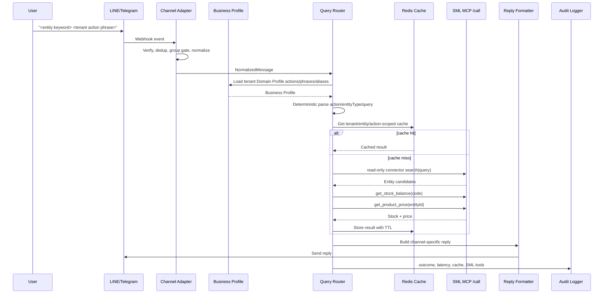
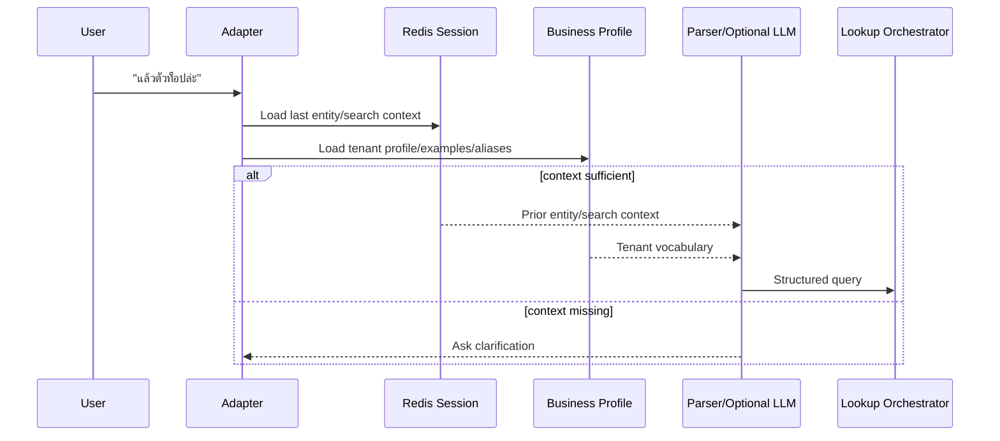
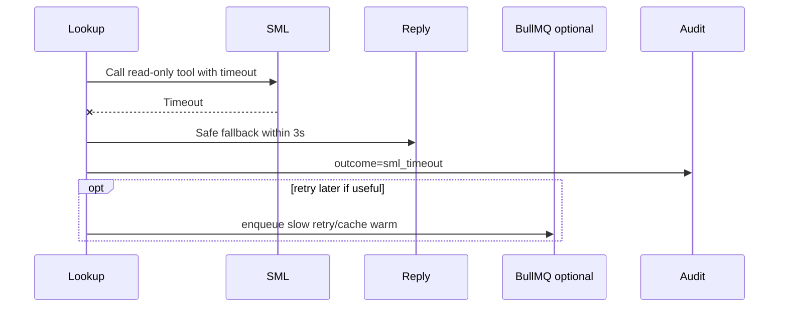

# Data Flow

The runtime data-acquisition rule is simple: channel messages and Business Profile data can shape the lookup, but user-facing facts must come from configured read-only connectors. In the current pilot, SML MCP is the only source of product search, stock, and price facts. LiteLLM is a parser only.

## 1. Fast Lookup

Use this path for clear entity ID or keyword queries that the tenant Business Profile can parse deterministically. In the current pilot, the entity is an SML inventory item and the actions are availability/price.



Rules:

- Do not call LLM on this path.
- Do not enqueue BullMQ job on this path.
- Do not hardcode business-specific names, brands, categories, or aliases in source code.
- Action phrases and examples come from Business Profile.
- Fetch stock and price concurrently after inventory entity resolution.
- Validate every SML parsed response before formatting.

## 2. Ambiguous Follow-Up

Use this path when the user depends on previous context.



Rules:

- LLM may only emit structured parse output such as action, entity type, query, search terms, and confidence.
- LLM output must not select arbitrary SML tool names.
- LLM prompt context must be generated from Business Profile data, not source-coded tenant keywords.
- If confidence is low, ask a clarification question instead of guessing.

## 3. No Match

```text
connector search(query) returns []
-> if LLM assist is enabled, parse once for safer searchTerms
-> retry connector search with validated assist terms only
-> reply with tenant profile no-match copy
-> do not call fact/detail tools
-> audit outcome=no_match
```

Assist rules:

- Send at most one assist status per incoming user message.
- Do not run assist for exact code or clear deterministic queries that already return SML candidates.
- Reject assist output on timeout, malformed JSON, invalid schema, low confidence, empty keyword/search terms, or truncated provider completion.
- Never use LLM output as lookup facts; SML remains the only source for current inventory facts.

## 4. Capability Gap

```text
message asks for a declared requestable capability
-> classify from Business Profile phrases, or LiteLLM enum-only assist
-> do not call SML fact/detail tools
-> reply that the source-system/SML team should add a read-only MCP for that capability
-> audit outcome=capability_gap and capability id
```

Rules:

- Do not use capability gaps for normal no-match, broad search, or SML timeout.
- Suggested MCP names come only from Business Profile, never from raw user text or LLM output.
- Optional `/ready` tool discovery can warn if suggested MCP tools are not present, but discovery must not choose tools for runtime calls.

## 5. Multiple Matches

```text
connector search(query) returns many candidates
-> collect a bounded candidate set
-> show 5 candidates at a time
-> reply with entity ID/label choices
-> store candidates plus current page in short session context
-> next user reply can choose by page-relative number/code or ask for "เพิ่ม"
```

The bot must not choose an entity when confidence is insufficient.

## 6. SML Timeout



Rules:

- User-facing reply must not expose raw SML error details.
- Retry must be bounded.
- Do not spam the channel with late replies unless the user experience explicitly supports it.

## 7. Channel Group Gate

Telegram group accepts a message only if one is true:

- bot is mentioned
- message replies to the bot
- supported command is used, as configured by Domain Profile command aliases
- configured prefix is used

LINE group accepts a message only if one is true:

- LINE mention component marks `isSelf: true`
- configured prefix is used

Private chats do not require mention.

## 8. Audit Event Shape

Minimum event fields:

```json
{
  "requestId": "req_...",
  "channel": "telegram",
  "tenantId": "tenant-a",
  "businessType": "retail",
  "chatType": "group",
  "chatIdHash": "hash",
  "userIdHash": "hash",
  "messageId": "message id",
  "intent": "stock_price",
  "action": "availability_price",
  "entityType": "inventory_item",
  "queryHash": "<hash or normalized metadata>",
  "parserSource": "deterministic",
  "parserConfidence": 0.98,
  "entityId": "A001",
  "cacheHit": false,
  "source": "sml",
  "smlTools": ["search_product", "get_stock_balance", "get_product_price"],
  "latencyMs": 842,
  "outcome": "success"
}
```

Do not log channel tokens, SML credentials, raw phone numbers, raw customer exports, or large raw SML payloads.
