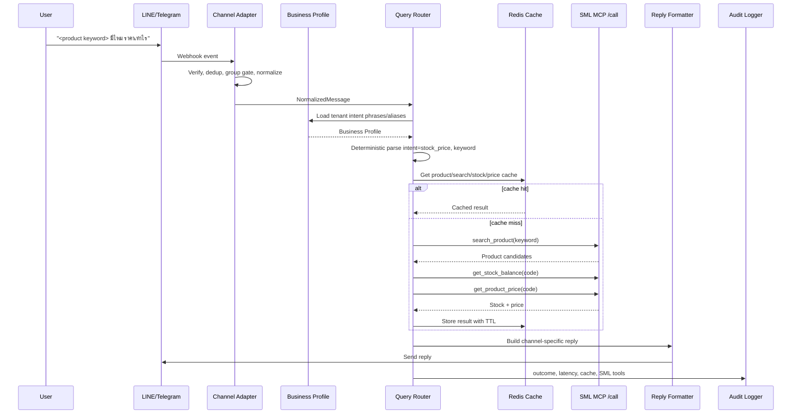
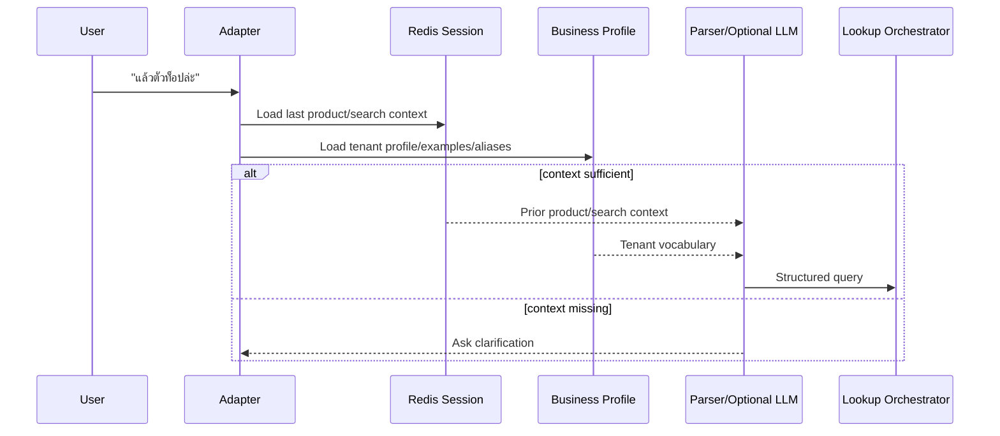
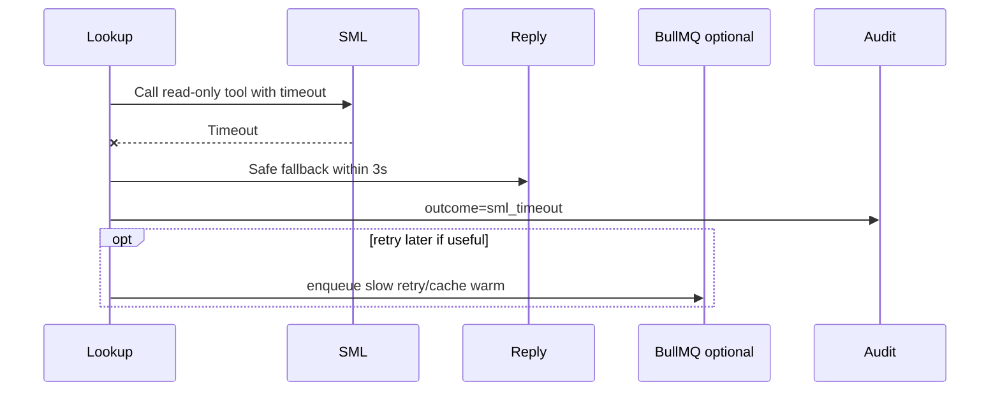

# Data Flow

## 1. Fast Stock/Price Lookup

Use this path for clear product code or keyword queries that the tenant Business Profile can parse deterministically.



Rules:

- Do not call LLM on this path.
- Do not enqueue BullMQ job on this path.
- Do not hardcode business-specific product names, brands, or aliases in source code.
- Intent phrases and examples come from Business Profile.
- Fetch stock and price concurrently after product resolution.
- Validate every SML parsed response before formatting.

## 2. Ambiguous Follow-Up

Use this path when the user depends on previous context.



Rules:

- LLM may only emit structured parse output such as intent, keyword, constraints, and confidence.
- LLM output must not select arbitrary SML tool names.
- LLM prompt context must be generated from Business Profile data, not source-coded tenant keywords.
- If confidence is low, ask a clarification question instead of guessing.

## 3. No Match

```text
search_product(keyword) returns []
-> if LLM assist is enabled, parse once for safer searchTerms
-> retry search_product with validated assist terms only
-> reply: "ไม่พบสินค้า ลองส่งรหัสสินค้า รุ่น ยี่ห้อ หรือคำค้นเพิ่ม"
-> do not call stock/price
-> audit outcome=no_match
```

Assist rules:

- Send at most one assist status per incoming user message.
- Do not run assist for exact code or clear deterministic queries that already return SML candidates.
- Reject assist output on timeout, malformed JSON, invalid schema, low confidence, empty keyword/search terms, or truncated provider completion.
- Never use LLM output as stock, price, or product truth; SML remains the only source for facts.

## 4. Multiple Matches

```text
search_product(keyword) returns many candidates
-> collect a bounded candidate set
-> show 5 candidates at a time
-> reply with product code/name/unit choices
-> store candidates plus current page in short session context
-> next user reply can choose by page-relative number/code or ask for "เพิ่ม"
```

The bot must not choose a product when confidence is insufficient.

## 5. SML Timeout



Rules:

- User-facing reply must not expose raw SML error details.
- Retry must be bounded.
- Do not spam the channel with late replies unless the user experience explicitly supports it.

## 6. Channel Group Gate

Telegram group accepts a message only if one is true:

- bot is mentioned
- message replies to the bot
- supported command is used, such as `/stock`, `/price`, `/find`
- configured prefix is used

LINE group accepts a message only if one is true:

- LINE mention component marks `isSelf: true`
- configured prefix is used

Private chats do not require mention.

## 7. Audit Event Shape

Minimum event fields:

```json
{
  "requestId": "req_...",
  "channel": "telegram",
  "tenantId": "tenant-a",
  "businessType": "retail",
  "chatType": "group",
  "chatIdHash": "hash",
  "userIdHash": "hash",
  "messageId": "message id",
  "intent": "stock_price",
  "productKeyword": "<normalized keyword>",
  "parserSource": "deterministic",
  "parserConfidence": 0.98,
  "productCode": "A001",
  "cacheHit": false,
  "smlTools": ["search_product", "get_stock_balance", "get_product_price"],
  "latencyMs": 842,
  "outcome": "success"
}
```

Do not log channel tokens, SML credentials, raw phone numbers, raw customer exports, or large raw SML payloads.
