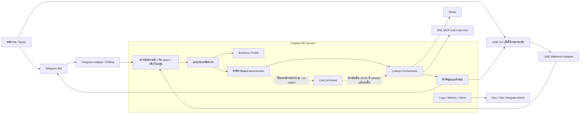
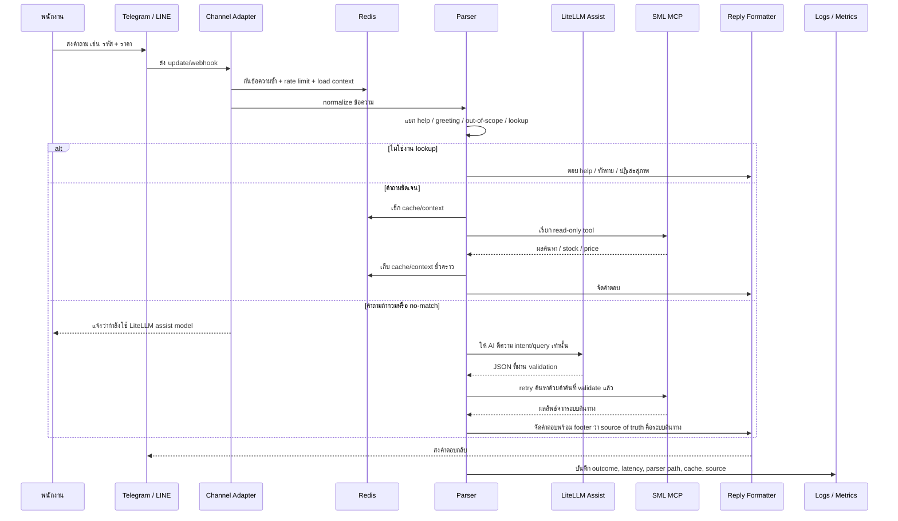

# System Design ปัจจุบันสำหรับทีม

เอกสารนี้อธิบายระบบ chatbot เช็กข้อมูลจากระบบต้นทางด้วยภาษาที่ทีมทั่วไปอ่านได้ ใช้สำหรับอธิบายก่อนปล่อย staff กลุ่มเล็ก 2-5 คนทดสอบใน Telegram

## สรุปสั้น

ระบบนี้คือ chatbot สำหรับพนักงานร้าน ใช้ถามข้อมูลแบบ read-only เช่น ค้นหารายการ เช็กของคงเหลือ และเช็กราคา โดยให้ระบบต้นทางเป็นแหล่งข้อมูลจริงเสมอ

ตอนนี้ช่องทางหลักที่ใช้ทดสอบคือ Telegram เพราะเปิดใช้งานง่ายและเร็ว ส่วน LINE เตรียม code ไว้แล้ว แต่จะเปิดจริงเมื่อมี credentials และ public webhook/tunnel พร้อม

ระบบไม่ได้ให้ AI ตอบราคา/สต็อกเอง AI ใช้แค่ช่วยตีความคำถามที่กำกวมหรือค้นหาไม่เจอ เช่น พนักงานพิมพ์ภาษาคนจริง ส่วนข้อมูลสุดท้ายยังต้องมาจากระบบต้นทางเท่านั้น

## ภาพรวมระบบ



## Tech Stack ที่ใช้

| ส่วน | เทคโนโลยี | ใช้ทำอะไร | เหตุผลที่เลือก |
| --- | --- | --- | --- |
| Runtime | Node.js + TypeScript | เขียน service หลัก | ecosystem ดีสำหรับ chatbot, API, Redis, Docker |
| HTTP API | Fastify | route `/health`, `/ready`, `/metrics`, webhook, internal smoke | เร็ว เบา และเหมาะกับ TypeScript |
| Telegram | Telegram Bot API แบบ direct adapter | pilot/debug/staff testing | ไม่ต้องมี public domain เมื่อใช้ polling, ทดสอบเร็ว |
| LINE | LINE Messaging API adapter | ช่องทาง production staff ในอนาคต | รองรับ webhook signature และ group mention |
| Cache/session | Redis | dedup, rate limit, cache, context, multi-match paging | เร็วและเหมาะกับระบบ stateless ที่ scale ได้ |
| Source of truth | SML MCP HTTP `/call` | ค้นหา, stock, price | ให้ ERP/source system เป็นข้อมูลจริง |
| LLM | LiteLLM | ช่วยตีความคำถามที่กำกวม | provider-swappable และเปิด/ปิดด้วย env ได้ |
| Schema validation | Zod | validate env, profile, SML response, LLM JSON | กันข้อมูลผิดรูปก่อนเข้าระบบ |
| Logging | Pino JSON logs | log แบบ structured | อ่านด้วย script/metrics ได้ง่าย และไม่เก็บ secret |
| Metrics | Prometheus-style `/metrics` | วัด outcome/latency/parser path | ใช้ดูความพร้อมก่อนปล่อยคนเยอะ |
| Deploy | Docker Compose | run `parts-lookup-api` + `parts-lookup-redis` | แยกจาก project อื่นบน server |
| Git deploy | `scripts/deploy-server-git.sh` | deploy จาก commit ที่ push แล้ว | rollback และ trace version ได้ |
| Offline Thai QA | PyThaiNLP tooling | วิเคราะห์คำถามไทยที่ no-match/unsupported | ไม่อยู่ใน runtime hot path จึงไม่ทำให้ bot ช้า |

## การทำงานเมื่อพนักงานถาม



## Fast Path กับ Slow Path

### Fast Path

ใช้เมื่อคำถามชัดเจน เช่น รหัสสินค้า, barcode-like input, คำถามราคาหรือสต็อกที่ profile เข้าใจ, หรือเลือกเลขจากรายการล่าสุด

```text
Telegram/LINE -> validate/dedup -> deterministic parser -> Redis/SML -> reply
```

ข้อดี:

- ไม่เรียก LLM
- ตอบเร็ว
- เหมาะกับงานหน้าร้านที่ต้องการความเร็ว

### Slow Path: LiteLLM Assist

ใช้เมื่อ deterministic parser ไม่เข้าใจ หรือค้น SML แล้วไม่เจอรายการ

```text
no-match / ambiguous -> LiteLLM parse JSON -> validate -> retry SML -> reply
```

ข้อสำคัญ:

- LiteLLM ไม่ตอบราคา ไม่ตอบสต็อก และไม่เลือกสินค้าตามใจเอง
- ถ้า LLM timeout หรือ output ผิด ระบบจะ fallback อย่างปลอดภัย
- ตอนนี้ model `openrouter/openrouter/free` latency ยังไม่นิ่ง บางครั้งเร็ว บางครั้งช้ามาก จึงมีข้อความแจ้ง user ว่ากำลังใช้ LiteLLM assist model

## Business Profile คืออะไร

Business Profile คือ config ของแต่ละธุรกิจ เช่น คำเรียก entity, action, ตัวอย่างคำถาม, alias, reply style และ connector mapping

ตัวอย่าง:

- ร้านวัสดุก่อสร้างอาจใช้คำว่า `สินค้า`, `รหัสสินค้า`
- ร้านอะไหล่อาจใช้คำว่า `อะไหล่`, `รหัสอะไหล่`, `รุ่นรถ`

หลักการคือเปลี่ยนธุรกิจให้แก้ที่ profile/connector ไม่แก้ core code

สิ่งที่อยู่ใน profile ได้:

- ตัวอย่างคำถาม
- คำพูดใน `/start` และ `/help`
- คำเรียก entity เช่น สินค้า/อะไหล่/เอกสาร
- action เช่น ค้นหา/เช็กของ/เช็กราคา
- alias หรือคำเรียกเฉพาะร้าน
- connector allowlist แบบ read-only

สิ่งที่ห้าม hardcode ใน runtime core:

- ชื่อสินค้า
- ยี่ห้อ
- category เฉพาะธุรกิจ
- alias เฉพาะ tenant
- ตัวอย่างที่ผูกกับร้านใดร้านหนึ่ง

## ข้อมูลจริงมาจากไหน

ระบบคุยกับ SML MCP ผ่าน HTTP `/call`

ตอนนี้ใช้ read-only tools:

- `search_product`
- `get_stock_balance`
- `get_product_price`

ระบบห้ามเรียก write tool เช่น `create_sale_reserve` ใน flow นี้

## Redis ใช้ทำอะไร

Redis เป็น memory store สำหรับงานที่ต้องเร็วและหมดอายุได้

ใช้เก็บ:

- ข้อความที่เคยตอบแล้ว เพื่อกัน duplicate reply
- rate limit ต่อ user/chat/channel
- cache ผลค้นหา/stock/price ตาม TTL
- context ล่าสุด เช่น user เลือกข้อ 1 แล้วถามต่อว่า “ราคา”
- รายการ multi-match สำหรับคำว่า “เพิ่ม”

ถ้า Redis มีปัญหา ระบบยังพยายาม fail safely และ `/ready` จะบอกว่าไม่พร้อมเต็มที่

## Logs และ Metrics เก็บอะไร

เก็บเพื่อดูคุณภาพระบบและช่วย debug หลัง staff ทดสอบ

เก็บ:

- outcome เช่น success, multiple_matches, no_match, dependency_error
- parser path เช่น deterministic, llm_assist, none
- latency
- cache hit/miss
- channel เช่น telegram/line/internal
- tenant/entity/action/source
- textHash/chatHash/userHash แทน raw text/user id

ไม่ควรเก็บ:

- token
- password
- secret
- raw chat id/user id
- payload ใหญ่จาก SML หรือ provider

หมายเหตุ: เพราะระบบไม่เก็บ raw text โดย default ถ้าอยากปรับจากคำถามจริง ควรให้ tester ส่ง transcript หรือ screenshot เฉพาะเคสที่ผิด/แปลกมาให้ review

## สถานะ Deploy ปัจจุบัน

| รายการ | สถานะ |
| --- | --- |
| Pilot server | `192.168.2.109:3060` |
| Runtime | Docker Compose |
| Containers | `parts-lookup-api`, `parts-lookup-redis` |
| SML MCP | `192.168.2.248:3515` |
| Telegram | เปิดใช้งานแบบ polling แล้ว |
| LINE | code พร้อม แต่ยังไม่เปิด production |
| LiteLLM | เปิด assist mode แล้ว |
| Current source data | SML dataset ที่ `192.168.2.248` |
| Current tenant status | `real` ตาม health payload |

## วิธีปล่อยทดสอบ Staff กลุ่มเล็ก

เริ่มจาก 2-5 คนก่อน เพื่อดูคุณภาพคำตอบและความเร็วจริง

ให้ tester ลอง:

- `/start`
- ทักทาย เช่น `สวัสดี`
- รหัส + ราคา
- ชื่อสินค้า + มีของไหม
- คำค้นกว้าง ๆ แล้วเลือกเลข 1-5
- พิมพ์ `เพิ่ม`
- หลังเลือกแล้วถาม `ราคา` หรือ `ตัวนี้ราคาเท่าไหร่`
- คำถามนอกเรื่อง เช่น `อากาศวันนี้เป็นยังไง`
- คำถามกำกวม เพื่อดู LiteLLM assist

ทีม dev ควรดู:

- duplicate reply มีไหม
- no-match มากผิดปกติไหม
- multi-match ใช้งานเข้าใจไหม
- LiteLLM ทำให้ user รอนานเกินไปไหม
- SML dependency มี error หรือ latency สูงไหม

## ข้อจำกัดที่ต้องบอกทีม

- Telegram พร้อม pilot แล้ว แต่ยังไม่ใช่ final rollout สำหรับทุกคน
- LINE ยังรอ credentials, public ingress, และ production smoke
- LiteLLM model ปัจจุบัน latency ไม่เสถียร ควรเปลี่ยน model หากต้องการ production UX ที่นิ่งกว่า
- คำถามจริงของ staff อาจมีคำเรียกเฉพาะร้าน ต้องเก็บเป็น reviewed examples/aliases ใน Business Profile
- ระบบนี้ยังเป็น read-only lookup ไม่ใช่ free-chat chatbot และไม่ทำรายการขาย/จองสินค้า

## สิ่งที่ทำให้ระบบพร้อมต่อยอด

- เปลี่ยนธุรกิจได้ด้วย Business Profile และ connector mapping
- Core ใช้ entity/action/source/context แบบ generic
- SML เป็น source of truth ไม่ให้ AI แต่งข้อมูล
- มี Redis สำหรับ scale/dedup/cache/context
- มี metrics/logs/alerts สำหรับ pilot
- Deploy ด้วย Git commit และ Docker Compose ทำให้ rollback ได้

